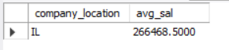

# Data Science Job Salaries 2024 Analysis (SQL)

### Question 1
Pinpoint countries who give work fully remotely, for the title 'managers’ paying salaries exceeding $90,000 USD.

````sql
select distinct company_location 
from salaries 
where remote_ratio = 100 and job_title like '%manager%' and salary_in_usd > 90000

````


### Question 2
Identifying top 5 Country Having greatest count of large (company size) number of companies.

````sql
select company_location, company_size,  count(*) as cnt
from salaries
where company_size = 'L' and experience_level = 'EN'
group by company_location, company_size
order by cnt desc
limit 5

````


### Question 3
Calculate the percentage of employees. Who enjoy fully remote roles WITH salaries Exceeding $100,000 USD, Shedding light ON the attractiveness of high-paying remote positions IN today's job market.

````sql
set @totemp = (select count(*) from salaries);
set @rem_emp = (select count(*) from salaries where remote_ratio = 100 and salary_in_usd > 100000 );

set @fre = (round((select @rem_emp )/(select @totemp)*100,2));
select @fre as percentage

````


### Question 4
Identify the Locations where entry-level average salaries exceed the average salary for that job title in market for entry level, helping agencies guide candidates towards lucrative opportunities.

````sql
select company_location, t.job_title
from (
select job_title, company_location, avg(salary_in_usd) as entry_avg_sal from salaries where experience_level = 'EN' group by job_title, company_location
)t inner join
(select job_title, avg(salary_in_usd) as avg_sal from salaries group by job_title
)m on t.job_title = m.job_title
where entry_avg_sal > avg_sal

````


### Question 5
Find out for each job title which. Country pays the maximum average salary. This helps you to place your candidates IN those countries.

````sql
select company_location, job_title from (
select job_title, company_location, avg(salary_in_usd) , dense_rank() over (partition by job_title order by avg(salary_in_usd) desc) as snk
from salaries
group by 1,2
order by 1,2
)t where snk = 1

````


### Question 6
Pinpoint Locations WHERE the average salary Has consistently Increased over the Past few years (Countries WHERE data is available for 3 years Only(present year and past two years) providing Insights into Locations experiencing Sustained salary growth.

````sql
select * 
from (
select company_location , avg(case when work_year = 2024 then salary_in_usd end) as sal_24,  
avg(case when work_year = 2023 then salary_in_usd end) as sal_23, 
avg(case when work_year = 2022 then salary_in_usd end) as sal_22
from salaries
group by company_location
)t 
where sal_24 > sal_23 and sal_23 > sal_22

````


### Question 7
Determine the percentage of fully remote work for each experience level IN 2021 and compare it WITH the corresponding figures for 2024, Highlighting any significant Increases or decreases IN remote work Adoption over the years.


````sql
select a.experience_level, pct_21, pct_24 from(
select t.experience_level, round(((rem_21)/(tot_21))*100,2) as pct_21
from (
select experience_level, count(*) as rem_21 from salaries where remote_ratio = 100 and work_year = 2021 group by experience_level
)t join (
select experience_level, count(*) as tot_21 from salaries where work_year = 2021 group by experience_level
)s on t. experience_level = s.experience_level
)a
join (
select t.experience_level, round(((rem_24)/(tot_24))*100,2) as pct_24
from (
select experience_level, count(*) as rem_24 from salaries where remote_ratio = 100 and work_year = 2024 group by experience_level
)t join (
select experience_level, count(*) as tot_24 from salaries where work_year = 2024 group by experience_level
)s on t.experience_level = s.experience_level
)b on a.experience_level = b.experience_level

````


### Question 8
Calculate the average salary increase percentage for each experience level and job title between the years 2023 and 2024, helping the company stay competitive IN the talent market.

````sql

with cte1 as (
select work_year, experience_level, job_title, avg(salary) as avg_sal from salaries where work_year in (2023,2024) group by 1,2,3
)

select experience_level, job_title, 
max(case when work_year = 2023 then avg_sal end) as avg_sal_23,
max(case when work_year = 2024 then avg_sal end) as avg_sal_24,
round(((max(case when work_year = 2024 then avg_sal end)-(max(case when work_year = 2023 then avg_sal end)))/(max(case when work_year = 2023 then avg_sal end)))*100,2) 
as pct_inc
from cte1
group by experience_level, job_title

````


### Question 9
You're a database administrator tasked with role-based access control for a company's employee database. Your goal is to implement a security measure where employees in different experience level (e.g. Entry Level, Senior level etc.) can only access details relevant to their respective experience level, ensuring data confidentiality and minimizing the risk of unauthorized access.

````sql
create user 'Entry_level'@'%' identified by 'EN';

create view entry_level as (
select * from salaries where experience_level = 'EN')
;

grant select on salaries.entry_level to 'Entry_level'@'%'


````


### Question 10
Investigate the job market for a company that analyzes workforce data. Your Task is to know how many people were employed IN different types of companies AS per their size IN 2021.

````sql
select company_size, count(*) as no_of_people_emp
from salaries
group by 1
````


### Question 11
Identify the top 3 job titles that command the highest average salary Among part-time Positions. However, you are Only Interested IN Countries WHERE there are more than 50 employees, Ensuring a robust sample size for your analysis.

````sql
select job_title, average, s.company_location
from (
SELECT job_title, AVG(salary_in_usd) AS 'average' , company_location
FROM salaries  
WHERE employment_type = 'PT'  
GROUP BY job_title , company_location
ORDER BY AVG(salary_IN_usd) DESC 
)t right join 
(select company_location,  count(*) as cnt
from salaries
 group by company_location
 having cnt > 50)s on t.company_location = s.company_location
 order by average desc
 limit 3

````


### Question 12
As a database analyst you have been assigned the task to Select Countries where average mid-level salary is higher than overall mid-level salary for the year 2023.

````sql
SET @average = ( select avg(salary_in_usd) as avg_sal from salaries where experience_level = 'MI' );

select company_location, sal_by_loc from (
select company_location, avg(salary_in_usd) as sal_by_loc
from salaries
where work_year = 2023 and experience_level = 'MI'
group by 1)t
where sal_by_loc > @average;

````


### Question 13
As a database analyst you have been assigned the task to Identify the company locations with the highest and lowest average salary for senior-level (SE) employees in 2023.

````sql

select company_location, avg(salary_in_usd) as avg_sal
from salaries
where experience_level = 'SE'
group by 1
order by avg_sal desc
limit 1
;
select company_location, avg(salary_in_usd) as avg_sal
from salaries
where experience_level = 'SE'
group by 1
order by avg_sal asc
limit 1

````



### Question 14
You're a Financial analyst Working for a leading HR Consultancy, and your Task is to Assess the annual salary growth rate for various job titles. By Calculating the percentage Increase IN salary FROM previous year to this year, you aim to provide valuable Insights Into salary trends WITHIN different job roles.

````sql

with t as (
select job_title, work_year, avg(salary_in_usd) as avg_sal
from salaries
where work_year in (2023,2024)
group by 1,2
)

select job_title, round(((avg_sal_24-avg_sal_23)/avg_sal_23)*100,2) as perct_change
from(
select job_title, max(case when work_year = 2023 then avg_sal end) as avg_sal_23, max(case when work_year = 2024 then avg_sal end) as avg_sal_24 
from t
group by job_title
)a where round(((avg_sal_24-avg_sal_23)/avg_sal_23)*100,2) is not null
;
````
Another Way - 
````sql
select l.job_title, avg_sal_23, avg_sal_24, round(((avg_sal_24-avg_sal_23)/avg_sal_23)*100,2) as perct_change
from ( 
select job_title, avg(salary_in_usd) as avg_sal_23
from salaries
where work_year = 2023
group by job_title)l inner join 
(
select job_title, avg(salary_in_usd) as avg_sal_24
from salaries
where work_year = 2024
group by job_title
)r on l.job_title = r.job_title


````


### Question 15
You've been hired by a global HR Consultancy to identify Countries experiencing significant salary growth for entry-level roles. Your task is to list the top three Countries with the highest salary growth rate FROM 2020 to 2023, Considering Only companies with more than 50 employees, helping multinational Corporations identify Emerging talent markets.

````sql

select * from salaries;
with t as (
select company_location, work_year, avg(salary_in_usd) as avg_sal
from salaries
where (work_year = 2021 or work_year = 2023) and experience_level = 'EN'
group by company_location, work_year
)

select *,  round(((avg_sal_23-avg_sal_20)/avg_sal_20)*100,2)
from( 
select company_location, 
max(case when work_year = 2021 then avg_sal end) as avg_sal_20,
max(case when work_year = 2023 then avg_sal end) as avg_sal_23
from t
group by company_location
)a
where round(((avg_sal_23-avg_sal_20)/avg_sal_20)*100,2) is not null
order by round(((avg_sal_23-avg_sal_20)/avg_sal_20)*100,2) desc
limit 3

````


### Question 16
Picture yourself as a data architect responsible for database management. Companies in US and AU(Australia) decided to create a hybrid model for employees they decided that employees earning salaries exceeding $90000 USD, will be given work from home. You now need to update the remote work ratio for eligible employees, ensuring efficient remote work management while implementing appropriate error handling mechanisms for invalid input parameters.

````sql
create table temp as select * from salaries;
set SQL_SAFE_UPDATES = 0;

update temp
set remote_ratio = 1
where company_location in ('US', 'AU') and salary_in_usd > 90000
;
select * from temp
;
````

### Question 17
In the year 2024, due to increased demand in the data industry, there was an increase in salaries of data field employees.

a.	Entry Level-35% of the salary.

b.	Mid junior – 30% of the salary.

c.	Immediate senior level- 22% of the salary.

d.	Expert level- 20% of the salary.

e.	Director – 15% of the salary.

You must update the salaries accordingly and update them back in the original database.

````sql

update temp
set salary_in_usd = 
	Case 
    when experience_level = 'EN' then salary_in_usd * 1.35 
    when experience_level = 'MI' then salary_in_usd * 1.30 
    when experience_level = 'SE' then salary_in_usd * 1.22 
    when experience_level = 'EX' then salary_in_usd * 1.20 
    when experience_level = 'DX' then salary_in_usd * 1.15 
    end
where work_year = 2024;


````


### Question 18
You are a researcher and you have been assigned the task to Find the year with the highest average salary for each job title.

````sql
select work_year, job_title, avg_sal
from (
select work_year, job_title, avg(salary_in_usd) as avg_sal, rank() over (partition by job_title order by avg(salary_in_usd) desc) as rnk
from salaries
group by 1,2
)t
where rnk = 1;

````


### Question 19
You have been hired by a market research agency where you been assigned the task to show the percentage of different employment type (full time, part time) in Different job roles, in the format where each row will be job title, each column will be type of employment type and cell value for that row and column will show the % value.

````sql

select job_title,
	(sum( case when employment_type = 'FT' then 1 else 0 end)/ count(*)) * 100 as FT_perc,  
	(sum( case when employment_type = 'PT' then 1 else 0 end)/ count(*)) * 100 as PT_perc,
	(sum( case when employment_type = 'CT' then 1 else 0 end)/ count(*)) * 100 as CT_perc,
	(sum( case when employment_type = 'FL' then 1 else 0 end)/ count(*)) * 100 as FL_perc
from salaries 
group by job_title 

````

